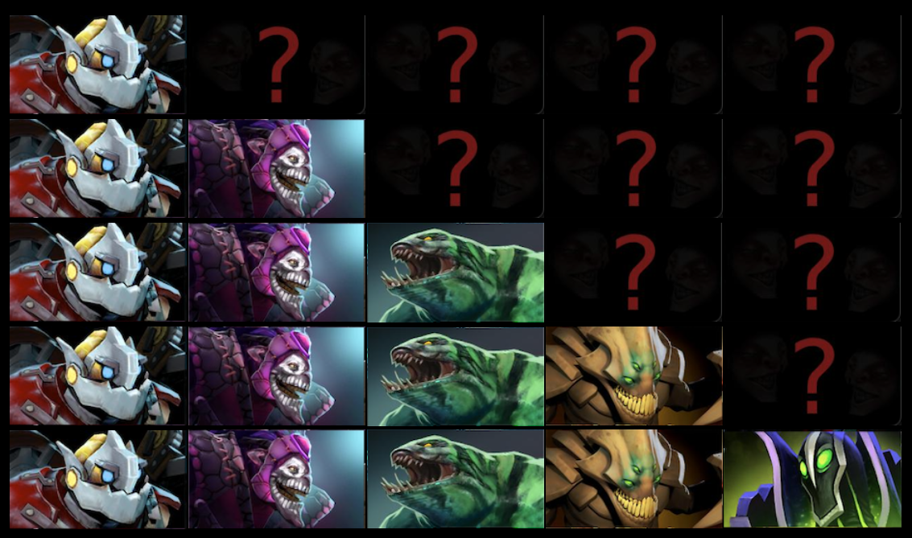

# HeroPicker

Dota 2 is a popular Moba where two teams of 5 players face each other by drawing from a large pool of over 120 heroes.

HeroPicker is a decoder-only Transformers model designed to answer the following question: *Given a list of hero picks/hero bans, which hero would a pro player choose to ban/pick next?*

We cast the question as a next-token prediction problem using masked self-attention, where each hero is represented as a token in a vocabulary.

Just for fun, the model also tries to predict which team (Radiant or Dire) won the match by looking at the final state of picks and bans.

# The data

Due to the changing landscape of the competitive meta, the dataset was created by drawing samples from competitive matches played in 2023[^1].
Patches usually introduce hero balancing measures, map changes, and other tweaks that alter the distribution of picks, and competitive Dota is very sensitive to these changes.
Pro teams try to get ahead by studying possible team compositions based on these changes, and the further back in time you go, the more noise is introduced in the data.

Since the order of picks and bans in Captain's mode is fixed, and we append a token to indicate which team won at the end of the match, our samples consist of sequences containing exactly 25 tokens[^2].

  
   
  <b>A graphical representation of a partial sample.</b>

# Results of the proof of concept and discussion

We adopt a 70/10/20 split for training, validation, and testing.

The model was trained for 1683 epochs and training was halted by the early stopping mechanism with patience = 3.
We use emb_dim = 512, 8 heads of attention, 4 stacked layers and a learning rate of 1^-6.

The final acc@1 was 0.10, while acc@5 (whether the picked hero was among the 5 predicted by the model) was 0.35.

Not too bad, and beating random by a large margin!

The accuracy on the winning team was 0.52, somewhat above the baseline of picking which side won the most, but this could have other explanations other than the model's having learned something.
This was a very hard task, specially when the model was trained on only about 20k samples, and in a distribution of pro players.

Since this is only a proof of concept, there are some ways to improve performance.
A natural extension to training a more robust model would be to include special tokens indicating what is the role of the picked/banned heroes in question.
For example, instead of passing simply '\[Magina\]', '\[WitchDoctor\]', '\[Mirana\]', one could pass '\[CARRY\]', '\[Magina\]', '\[SUPPORT\]', '\[WitchDoctor\]', '\[MID\]''\[Zeus\]' to the model,
which could help the model narrow down its choices even further (as we would expect it to learn that no team is composed only of carry heroes, etc).

# Bring your own data

If you wish to train the model on more data, you simply have to use the 'datacleaner.ipynb' notebook, and set-up the correct directories in the first cell.

Notice that we assume the data to come from Captain's Mode matches. Changing the cleaning and training processes to accommodate for public All-Pick matches shouldn't be a problem but takes some work.

We take the data for pick/bans from 'pick_bans_(YEAR).csv' files, and match results from 'main_metadata_(YEAR).csv' files. (I have not looked into earlier years, so I cannot say whether the format is consistent through time).

In order to train, simply open 'herotrainer.py', adjust the config_dict variable to your desired hyperparameters and execute the script. For evaluation, use the 'evaluer.ipynb' notebook.

[^1]: The data was taken from the [Dota 2 Pro League Matches 2016-2024](https://www.kaggle.com/datasets/bwandowando/dota-2-pro-league-matches-2023?resource=download) dataset.
[^2]: We get rid of matches where heroes were not banned due to time or other problems.